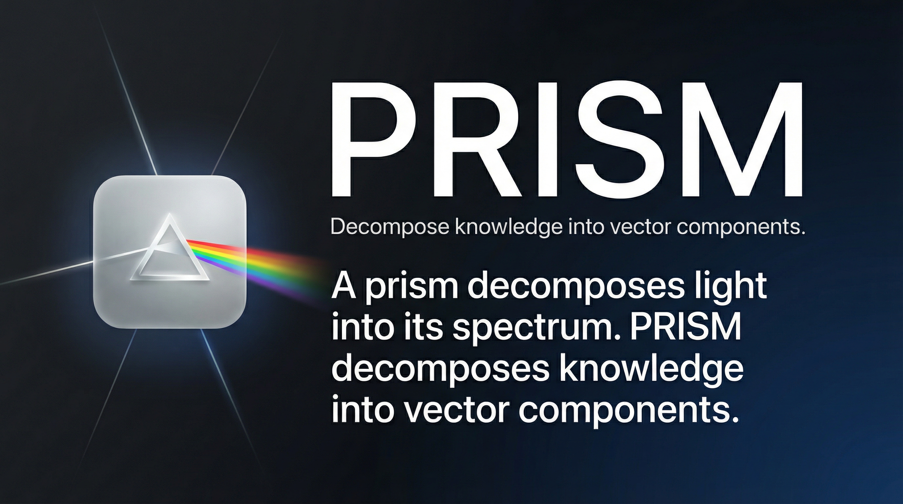

<p align="center">
  
</p>

<p align="center">
  <h1 align="center">🔷 PRISM</h1>
  <p align="center"><strong>Pattern Reasoning via Interpretable Symbolic Memory</strong></p>
  <p align="center">
    <em>A neural-free cognitive architecture for knowledge reasoning using Vector Symbolic Architectures</em>
  </p>
</p>

<p align="center">
  
  
  
  
  
</p>

---

## Abstract

**PRISM** is a knowledge reasoning engine built on **Vector Symbolic Architectures** (VSA), also known as Hyperdimensional Computing (HDC). Unlike large language models that require billions of parameters and extensive training, PRISM performs complex cognitive operations — analogy, causal inference, multi-hop reasoning, temporal analysis, and contradiction detection — through **algebraic operations on high-dimensional vectors**.

Every inference is **transparent and traceable**: there are no hidden weights, no attention layers, no gradient-based learning. Knowledge is encoded as distributed holographic vectors, and reasoning emerges from binding, bundling, and similarity operations in hyperspace.

PRISM represents a fundamentally different approach to AI reasoning: **one that is explainable by construction, not by post-hoc interpretation.**

---

## Key Contributions

| Property | Traditional LLMs | PRISM |
|---|---|---|
| **Architecture** | Transformer (attention + FFN) | VSA (bind + bundle + similarity) |
| **Parameters** | Billions | Zero learned parameters |
| **Reasoning** | Implicit (emergent from weights) | Explicit (vector algebra) |
| **Explainability** | Post-hoc (SHAP, attention viz) | Intrinsic (full reasoning trace) |
| **Hallucination** | Frequent and confident | Impossible — output is grounded |
| **Hardware** | GPU cluster | Single CPU core |
| **Training** | Weeks on internet-scale data | Seconds on structured facts |
| **Knowledge Update** | Full retraining / fine-tuning | Incremental vector addition |

---

## Theoretical Foundations

PRISM is grounded in the mathematical framework of **Holographic Reduced Representations** (Plate, 1995) and the broader family of Vector Symbolic Architectures (Kanerva, 2009; Gayler, 2003).

### Core Operations

Given a *d*-dimensional hyperspace ℝ*ᵈ* (typically *d* = 300–10,000):

| Operation | Symbol | Function | Algebraic Property |
|---|---|---|---|
| **Binding** | ⊛ | Circular convolution | Creates associations: `A ⊛ B` encodes "A is related to B" |
| **Unbinding** | ⊘ | Circular correlation | Retrieves associations: `(A ⊛ B) ⊘ A ≈ B` |
| **Bundling** | ⊕ | Element-wise addition | Superimposes multiple items: `A ⊕ B ⊕ C` |
| **Similarity** | cos(·,·) | Cosine similarity | Measures relatedness in hyperspace |

### Knowledge Encoding

A fact like *"cats are mammals"* is encoded as a **composite vector**:

```
v_fact = bind(v_cat, ROLE_SUBJECT) ⊕ bind(v_mammal, ROLE_OBJECT) ⊕ bind(v_is_a, ROLE_RELATION)
```

This holographic representation preserves all role-filler bindings in a single fixed-dimensional vector, enabling:
- **Graceful degradation**: partial matches return approximate results
- **One-shot learning**: new facts are stored by a single vector addition
- **Compositionality**: complex structures are built from primitive operations

### Reasoning as Vector Algebra

| Reasoning Type | Vector Operation |
|---|---|
| **Analogy** (*A:B :: C:?*) | `? ≈ unbind(bind(B, inv(A)), C)` |
| **Multi-hop** (*A→B→C*) | `chain = bind(A→B, B→C)` then unbind |
| **Causal Inference** | Temporal binding + transitive closure |
| **Contradiction** | `cos(v_fact₁, v_fact₂) < -θ` |

---

## Architecture

```
┌─────────────────────────────────────────────────────────────┐
│                      PRISM Engine                           │
├─────────────┬───────────────┬───────────────┬───────────────┤
│  Perception │   Memory      │   Reasoning   │   Expression  │
│  Layer      │   Layer       │   Layer       │   Layer       │
├─────────────┼───────────────┼───────────────┼───────────────┤
│ NLU Parser  │ Episodic      │ VSA Reasoner  │ Semantic      │
│ Semantic    │  Memory       │ Analogy       │  Weaver       │
│  Router     │ User Profile  │  Engine       │ Response      │
│ Entity      │ Conversation  │ Causal        │  Composer     │
│  Extractor  │  Context      │  Reasoner     │ Quality       │
│ Role        │ Knowledge     │ Multi-hop     │  Gate         │
│  Labeler    │  Graph        │  Reasoner     │               │
│             │ Episode       │ Temporal      │               │
│             │  Index        │  Reasoner     │               │
│             │               │ Contradiction │               │
│             │               │  Detector     │               │
└─────────────┴───────────────┴───────────────┴───────────────┘
         │              │              │              │
         └──────────────┴──────────────┴──────────────┘
                              │
                    ┌─────────┴─────────┐
                    │  Swarm            │
                    │  Orchestrator     │
                    │  (Blackboard      │
                    │   Architecture)   │
                    └───────────────────┘
```

### Module Breakdown

#### 1. Perception Layer — `parsing/`
Converts raw natural language into structured semantic representations.

- **NLU Parser** — Intent classification, entity extraction, and semantic role labeling using pattern matching and vector similarity (no neural NLU)
- **Semantic Router** — Routes queries to the appropriate reasoning pipeline based on query type classification (factual, comparative, causal, temporal, yes/no)
- **User Statement Parser** — Extracts structured facts from declarative user statements for knowledge acquisition

#### 2. Memory Layer — `memory/`
Holographic distributed memory using VSA episodic encoding.

- **Episodic Memory** — Stores facts as holographic vectors; supports similarity-based retrieval with configurable confidence thresholds
- **User Profile** — Maintains a persistent vector representation of user preferences, name, and interaction history
- **Conversation Context** — Short-term working memory for multi-turn dialogue coherence
- **Episode Index** — Efficient retrieval index for large-scale episodic stores
- **Persistence** — Disk serialization of the full memory state (`.npz` + `.pkl`)

#### 3. Reasoning Layer — `reasoning/`
The core intellectual engine — all reasoning is performed through VSA algebra.

- **VSA Reasoner** — Central reasoning dispatcher; coordinates all sub-reasoners
- **Analogy Engine** — Proportional analogy (*A:B :: C:?*) via binding arithmetic
- **Multi-hop Reasoner** — Chains multiple relational steps (*A→B→C→?*) through iterative unbinding
- **Causal Reasoner** — Infers causal relationships from temporal co-occurrence and relational patterns
- **Temporal Reasoner** — Reasons about time-ordered events and durations
- **Contradiction Detector** — Identifies conflicting facts via negative cosine similarity
- **Transitive Reasoner** — Applies transitivity (*A IS-A B, B IS-A C → A IS-A C*)
- **Confidence Scorer** — Calibrates reasoning confidence using multiple evidence signals

#### 4. Expression Layer — `agents/`, `generation/`
Generates natural language responses from structured reasoning output.

- **Semantic Weaver** — Phrase-level text assembly driven by vector similarity scoring (no templates, no LLM)
- **Response Composer** — Formats final responses with evidence grounding
- **Quality Gate** — Validates response coherence and evidence sufficiency before output

#### 5. Orchestration — `agents/orchestrator.py`
Coordinates reasoning through a **Blackboard Architecture**:

1. Query arrives → Perception layer parses intent and entities
2. Task Planner creates an execution plan
3. Swarm of specialist agents work the Blackboard concurrently:
   - **Wikipedia Agent** — Retrieves encyclopedic evidence
   - **Wikidata Agent** — Queries structured knowledge graphs
   - **WordNet Agent** — Accesses lexical relationships
   - **File Agent** — Reads local documents
   - **Web Search Agent** — Falls back to web search
4. Quality Gate validates sufficiency
5. Reasoning layer processes findings
6. Expression layer generates the response

---

## Knowledge Acquisition Pipeline

PRISM learns from multiple structured knowledge sources:

```
ConceptNet ─────┐
                ├──→ Knowledge Integrator ──→ Episodic Memory
WordNet ────────┤          │
                │     Deduplication
SimpleWiki ─────┤     Conflict Resolution
                │     Confidence Scoring
User Input ─────┘
```

### Supported Knowledge Sources

| Source | Facts | Type | Coverage |
|---|---|---|---|
| **ConceptNet** | Commonsense relations | IS-A, CAN, HAS, USED-FOR, ... | 600K+ English assertions |
| **WordNet** | Lexical taxonomy | IS-A hierarchy + definitions | 117K synsets |
| **SimpleWiki** | Encyclopedic facts | Entity descriptions | 200K+ articles |
| **User Input** | Interactive learning | Any declared fact | Unlimited |

### Training

```bash
# Train on all knowledge sources
python scripts/train_knowledge.py --output data/knowledge.json.gz

# Control scope
python scripts/train_knowledge.py --max-synsets 5000 --skip-wiki

# Load into memory
python -m gunter --load-knowledge data/knowledge.json.gz
```

---

## Installation

```bash
# Clone
git clone https://github.com/your-username/prism.git
cd prism

# Install
pip install -e .

# Download language model (word vectors only — no neural inference)
python -m spacy download en_core_web_md
```

### Requirements

- **Python** 3.10+
- **NumPy** — Vector operations
- **spaCy** — Word embeddings (300d vectors from `en_core_web_md`)
- **No GPU required** — Pure CPU computation
- **No internet required** — Fully offline after setup

---

## Usage

### Interactive Mode

```bash
python -m gunter
```

```
🔷 PRISM v0.1 — Pattern Reasoning via Interpretable Symbolic Memory
Type 'quit' to exit.

You: What is quantum entanglement?
PRISM: [retrieves evidence → reasons → generates response]

You: How is it different from classical correlation?
PRISM: [comparison reasoning via vector arithmetic]

You: learn photons are quantum particles
PRISM: ✓ photons IS-A quantum particles [0.95]

You: Can photons be entangled?
PRISM: ✅ Yes — [multi-hop: photons IS-A quantum particles, quantum particles CAN entangle]
```

### Programmatic API

```python
from gunter.main import Gunter

prism = Gunter()

# Interactive reasoning
response = prism.process_input("What do cats and dogs have in common?")
print(response)

# Knowledge acquisition
prism.process_input("learn dolphins are marine mammals")
prism.process_input("learn dolphins can echolocate")

# Multi-hop query
response = prism.process_input("Can marine mammals echolocate?")
# → Uses transitive reasoning: dolphins IS-A marine mammals + dolphins CAN echolocate
```

---

## Evaluation

### Test Suite

```bash
python tests/test_knowledge_loading.py
```

**46/46 tests passing** across 8 test categories:

| Test Suite | Tests | Coverage |
|---|---|---|
| ConceptNet Loader | 9/9 | Entity cleaning, filtering, relation mapping |
| WordNet Loader | 6/6 | Synset extraction, hierarchy, performance |
| SimpleWiki Loader | 6/6 | Markup stripping, disambiguation, samples |
| Knowledge Integrator | 5/5 | Dedup, multi-source fusion, persistence |
| Memory Extensions | 7/7 | Batch store, disk I/O, query recall |
| End-to-End Pipeline | 6/6 | Load → store → query → reason |
| Training Script | 3/3 | CLI integration, WordNet pipeline |
| Regression | 4/4 | Name learning, fact acquisition, QA |

---

## Reasoning Examples

### Analogy Reasoning

```
Query: "cat is to kitten as dog is to ?"
Operation: unbind(bind(v_kitten, inv(v_cat)), v_dog)
Result: v_puppy (cos = 0.82)
Answer: puppy
```

### Multi-hop Inference

```
Knowledge:
  - sparrow IS-A bird
  - bird CAN fly
  - bird HAS feathers

Query: "Can sparrows fly?"
Chain: sparrow →[IS-A]→ bird →[CAN]→ fly
Confidence: 0.95 × 0.88 = 0.84
Answer: ✅ Yes — sparrows can fly (inferred via bird)
```

### Contradiction Detection

```
Knowledge:
  - penguins IS-A bird
  - penguins CANNOT fly
  - bird CAN fly

Detection: cos(v_cannot_fly, v_can_fly) = -0.91
Alert: ⚠️ Contradiction — penguins inherit "CAN fly" from bird,
       but have explicit "CANNOT fly" override.
Resolution: Specific override wins (confidence 0.95 > inherited 0.72)
```

---

## How PRISM Differs from LLMs

### The Fundamental Distinction

An LLM is a **statistical language model** — it predicts the next token based on learned patterns from trillions of tokens. Reasoning is an emergent, uncontrollable side effect.

PRISM is a **symbolic reasoning engine** — it manipulates knowledge representations through well-defined algebraic operations. Reasoning is the explicit, primary function.

```
LLM:    Input → [Billions of weights] → Output (opaque)
PRISM:  Input → Parse → Retrieve → Reason → Express (transparent at every step)
```

### When to Use PRISM Over an LLM

| Use Case | PRISM | LLM |
|---|---|---|
| Explainable medical reasoning | ✅ Full trace | ❌ Black box |
| Offline embedded systems | ✅ ~50MB, CPU | ❌ Requires GPU/API |
| Zero-hallucination QA | ✅ By construction | ❌ Requires guardrails |
| Incremental knowledge updates | ✅ Single vector add | ❌ Fine-tuning needed |
| Creative text generation | ❌ Limited | ✅ Excellent |
| Open-ended conversation | ❌ Limited | ✅ Excellent |

---

## Project Structure

```
prism/
├── src/gunter/
│   ├── core/             # VSA primitives: binding, bundling, similarity
│   │   ├── lexicon.py        # Word → vector mapping with role vectors
│   │   └── vector_ops.py     # Circular convolution, correlation, cosine
│   ├── parsing/          # Natural Language Understanding
│   │   ├── __init__.py       # NLU parser, intent classifier
│   │   ├── semantic_roles.py # Semantic role labeling
│   │   └── user_statement_parser.py
│   ├── memory/           # Holographic episodic memory
│   │   ├── __init__.py       # EpisodicMemory, HolographicVector
│   │   ├── episode_index.py  # Efficient similarity search index
│   │   ├── persistence.py    # Disk serialization
│   │   ├── user_profile.py   # User model
│   │   └── conversation_context.py
│   ├── reasoning/        # VSA reasoning engines
│   │   ├── vsa_reasoner.py       # Central coordinator
│   │   ├── analogy_engine.py     # Proportional analogy
│   │   ├── multihop.py           # Chain reasoning
│   │   ├── causality.py          # Causal inference
│   │   ├── temporal.py           # Time-aware reasoning
│   │   ├── contradiction.py      # Conflict detection
│   │   ├── transitive.py         # Inheritance reasoning
│   │   └── confidence.py         # Evidence scoring
│   ├── agents/           # Swarm intelligence layer
│   │   ├── orchestrator.py       # Blackboard controller
│   │   ├── semantic_weaver.py    # VSA-driven text generation
│   │   ├── semantic_router.py    # Query classification
│   │   ├── response_composer.py  # Response assembly
│   │   ├── wikipedia_agent.py    # Evidence retrieval
│   │   ├── wikidata_agent.py     # Structured knowledge
│   │   └── wordnet_agent.py      # Lexical relations
│   ├── data/             # Knowledge acquisition pipeline
│   │   └── loaders/          # ConceptNet, WordNet, SimpleWiki
│   └── main.py           # PRISM entry point
├── scripts/
│   └── train_knowledge.py    # Knowledge base construction
├── tests/
│   └── test_knowledge_loading.py  # 46 comprehensive tests
└── data/                 # Training data and knowledge bases
```

---

## Theoretical References

1. **Plate, T.A.** (1995). *Holographic Reduced Representations*. IEEE Transactions on Neural Networks, 6(3), 623-641.
2. **Kanerva, P.** (2009). *Hyperdimensional Computing: An Introduction to Computing in Distributed Representation with High-Dimensional Random Vectors*. Cognitive Computation, 1(2), 139-159.
3. **Gayler, R.W.** (2003). *Vector Symbolic Architectures Answer Jackendoff's Challenges for Cognitive Neuroscience*. ICCS/ASCS Joint Conference.
4. **Rachkovskij, D.A. & Kussul, E.M.** (2001). *Binding and Normalization of Binary Sparse Distributed Representations by Context-Dependent Thinning*. Neural Computation, 13(2), 411-452.
5. **Kleyko, D. et al.** (2023). *A Survey on Hyperdimensional Computing: Theory and Applications*. ACM Computing Surveys, 55(6), 1-51.

---

## Citation

If you use PRISM in your research, please cite:

```bibtex
@software{prism2026,
  title={PRISM: Pattern Reasoning via Interpretable Symbolic Memory},
  author={[Your Name]},
  year={2026},
  url={https://github.com/your-username/prism},
  note={A neural-free cognitive architecture for knowledge reasoning
        using Vector Symbolic Architectures}
}
```

---

## License

MIT License — See [LICENSE](LICENSE) for details.

---

<p align="center">
  <strong>PRISM</strong> — <em>Where reasoning is algebra, not statistics.</em>
</p>
